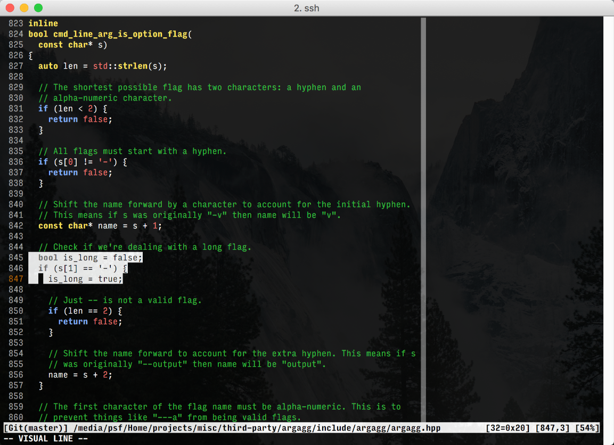
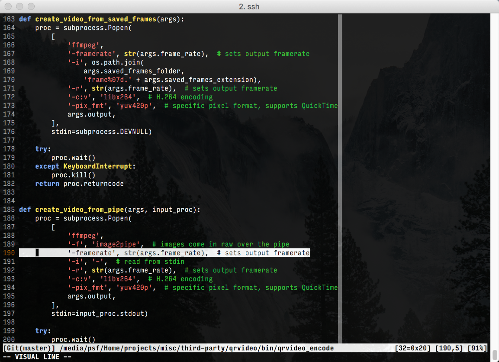
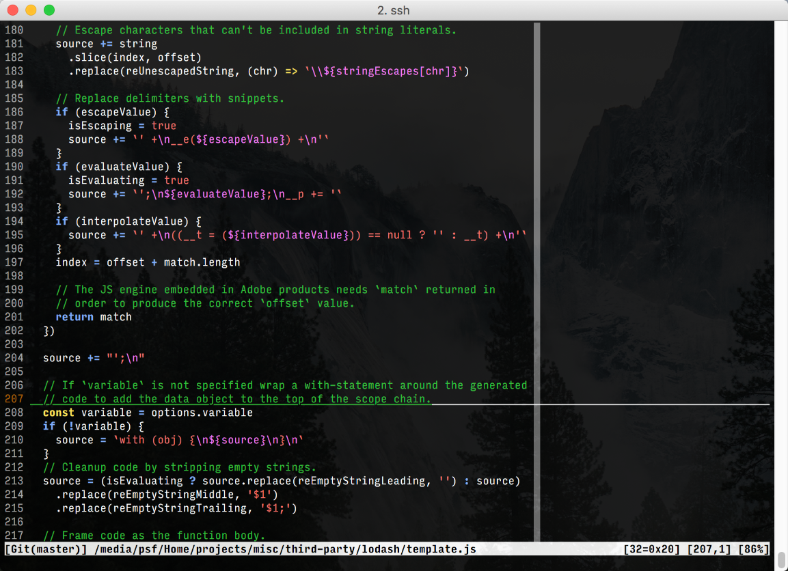
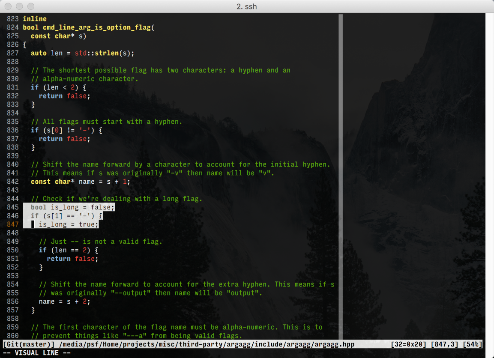
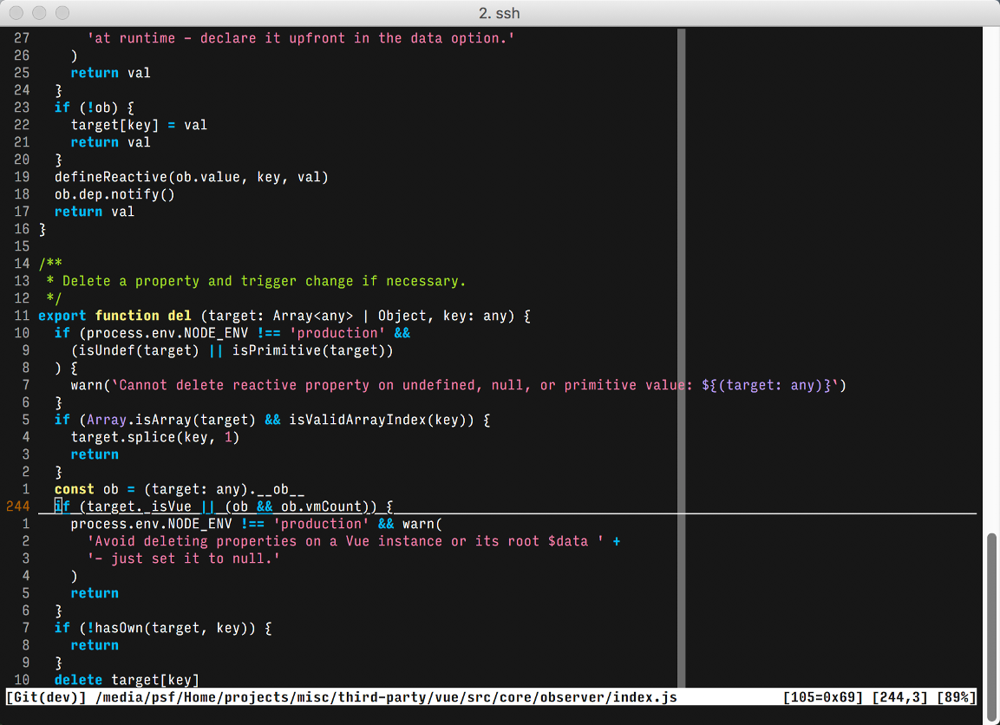

A simple vim colorscheme that focuses on using named colors and not direct hex or RGB values. This essentially deferrs to the user's terminal for final coloring (such as iterm color schemes, of which one is provided). Colors are chosen for visual distinction amongst syntax elements.

# Screenshots

C++ source with provided iterm color scheme:



Python source with provided iterm color scheme:



Javascript source with provided iterm color scheme:



C++ source with iterm's "Tango Dark" color scheme:



Javascript source with iterm "Molokai" color scheme:



# Install

Install using your favorite vim plugin manager (for example, [vim-pathogen](https://github.com/tpope/vim-pathogen)).

# Usage

```VimL
syntax on
colorscheme toy-blocks
```

# iterm Color Scheme

An iterm color scheme is also included which is a dark color scheme that is a slight variation on the standard iterm color scheme for better legibility, particularly with the blue.

# Name

The use of primary colors reminds me of kids ***toys***. The deference to the user's terminal for final coloring means the scheme is mostly a "building ***block***" for your final color scheme.
